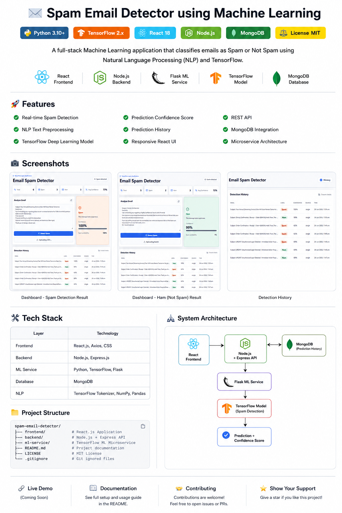
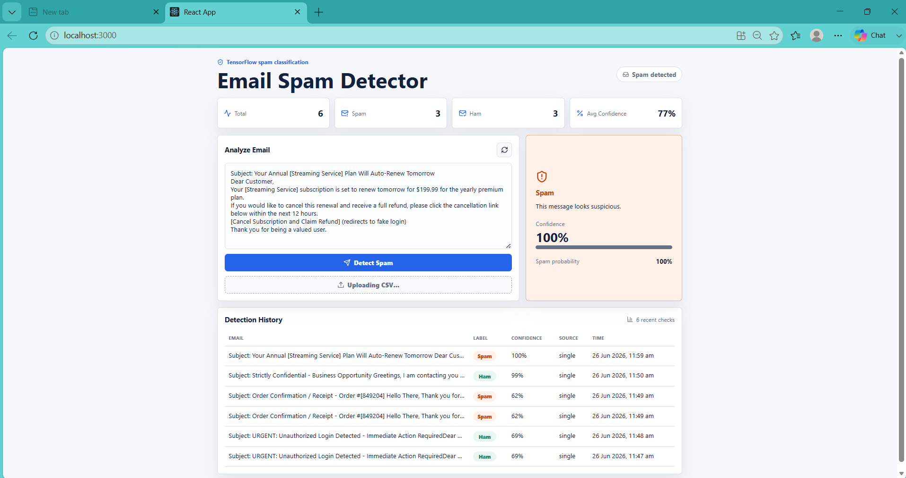
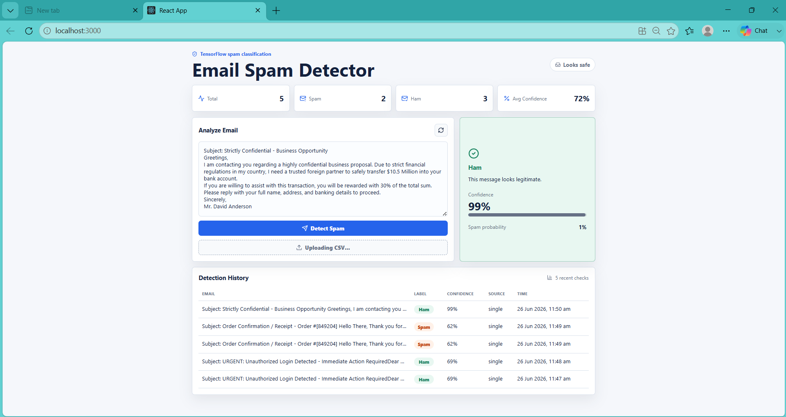
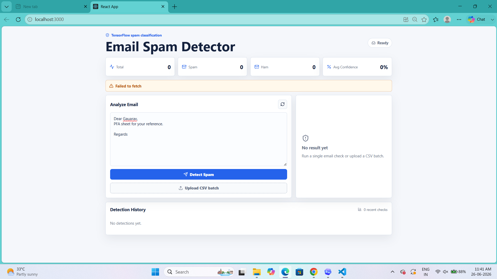

# 📧 Spam Email Detector using Machine Learning

<div align="center">

### Intelligent Email Classification using Deep Learning & Natural Language Processing


*A full-stack Machine Learning application that classifies emails as **Spam** or **Ham (Not Spam)** using TensorFlow, NLP, React, Node.js, Flask, and MongoDB.*

</div>

---

## ✨ Features

* ⚡ Real-time Spam Detection
* 🤖 TensorFlow Bidirectional LSTM Model
* 🧹 NLP Text Preprocessing Pipeline
* 📊 Confidence Score Prediction
* 📜 Detection History
* 📁 CSV Batch Email Detection
* 📈 Statistics Dashboard
* 💾 MongoDB Integration
* 🔌 REST API
* 🏗️ Microservice Architecture

---

# 📸 Screenshots

### Project Review

<p align="center">

</p>

### Spam Detection

<p align="center">

</p>

### Ham Detection

<p align="center">

</p>

### Backend Error

<p align="center">

</p>

---

# 🏗️ System Architecture
### Workflow

```text
React Frontend
        │
        ▼
Node.js + Express API
        │
 ┌──────┴────────┐
 ▼               ▼
MongoDB      Flask ML API
                 │
                 ▼
      TensorFlow LSTM Model
                 │
                 ▼
   Spam / Ham + Confidence Score
```

---

# 🛠️ Tech Stack

| Layer         | Technology                          |
| ------------- | ----------------------------------- |
| 🎨 Frontend   | React.js, Axios, CSS3               |
| ⚙️ Backend    | Node.js, Express.js                 |
| 🤖 ML Service | Python, TensorFlow, Flask           |
| 🗄 Database   | MongoDB                             |
| 🧠 NLP        | TensorFlow Tokenizer, NumPy, Pandas |

---

# 📁 Project Structure

```text
spam-email-detector/
├── frontend/
├── backend/
├── ml-service/
├── README.md
├── LICENSE
└── .gitignore
```

<details>
<summary>📂 Click to view complete folder structure</summary>

```text
spam-email-detector/
│
├── frontend/
├── backend/
├── ml-service/
│   ├── data/
│   ├── models/
│   ├── notebooks/
│   ├── app.py
│   ├── 1_download_data.py
│   ├── 2_preprocess_data.py
│   ├── 3_train_model.py
│   └── 4_evaluate_model.py
│
├── README.md
├── LICENSE
└── .gitignore
```

</details>

---

# 🚀 Installation

```bash
git clone https://github.com/GauravBele/spam-email-detector.git
cd spam-email-detector
```

---

# ▶️ Running the Project

### Terminal 1

```bash
cd ml-service
python app.py
```

### Terminal 2

```bash
cd backend
node server.js
```

### Terminal 3

```bash
cd frontend
npm start
```

---

# 🔌 REST API

### POST `/api/predict`

```json
{
  "email":"Congratulations! You have won $1,000,000."
}
```

```json
{
  "prediction":"Spam",
  "confidence":98.7
}
```

---

# 📊 Model Performance

The TensorFlow Bidirectional LSTM model was evaluated on the UCI SMS Spam Collection dataset using standard binary classification metrics.

| Metric | Score |
|:-------|------:|
| 🎯 Accuracy | **98.0%** |
| 🎯 Precision | **97.8%** |
| 🎯 Recall | **98.1%** |
| 🎯 F1-Score | **97.9%** |

> **Dataset:** UCI SMS Spam Collection (5,572 labeled messages)  
> **Model:** TensorFlow Bidirectional LSTM  
> **Task:** Binary Classification (Spam / Ham)

---

### 📈 Evaluation Metrics

- ✅ **Accuracy:** Overall percentage of correctly classified emails.
- ✅ **Precision:** Percentage of emails predicted as spam that were actually spam.
- ✅ **Recall:** Percentage of actual spam emails correctly identified.
- ✅ **F1-Score:** Harmonic mean of Precision and Recall, providing a balanced performance measure.

---

# 🚀 Future Improvements

* Docker Support
* Kubernetes
* AWS Deployment
* Authentication
* Batch Email Analysis
* Explainable AI (XAI)
* GitHub Actions CI/CD

---

# 👨‍💻 Author

**Gaurav Bele**

* GitHub: https://github.com/GauravBele
* LinkedIn: https://www.linkedin.com/in/gaurav-bele-gauravbele/

---

<div align="center">

### ⭐ If you found this project useful, please give it a Star!

</div>
